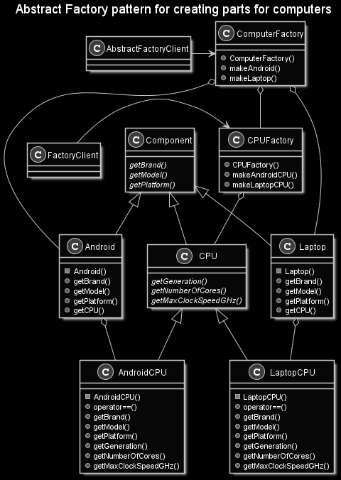

# Abstract Factory Pattern
This project is a showcase of the Abstract Factory pattern, which is a Creational pattern that is used to create similar types of objects. [The key difference between a Factory Method pattern and an Abstract Factory pattern is noted in this brilliant answer from Stack Overflow.](https://stackoverflow.com/a/13030163/5849965)

# Synopsis
In this example, I have a Computer factory that creates various computer type factories, such as Laptop and Android factories, which in turn have their own factories for creating parts such as CPUs. [This example is inspired by this answer on Stack Overflow.](https://stackoverflow.com/a/13029726/5849965)

## Tools
* C++ 14
  * _Note that I programmed to a C++98 convention_
* CMake 3.16.3

## Resources
* https://www.wikiwand.com/en/Abstract_factory_pattern
* https://www.tutorialspoint.com/design_pattern/abstract_factory_pattern.htm
* https://stackoverflow.com/questions/5739611/what-are-the-differences-between-abstract-factory-and-factory-design-patterns
* https://stackoverflow.com/questions/1001767/what-is-the-basic-difference-between-the-factory-and-abstract-factory-design-pat
* https://stackoverflow.com/questions/13029261/design-patterns-factory-vs-factory-method-vs-abstract-factory

