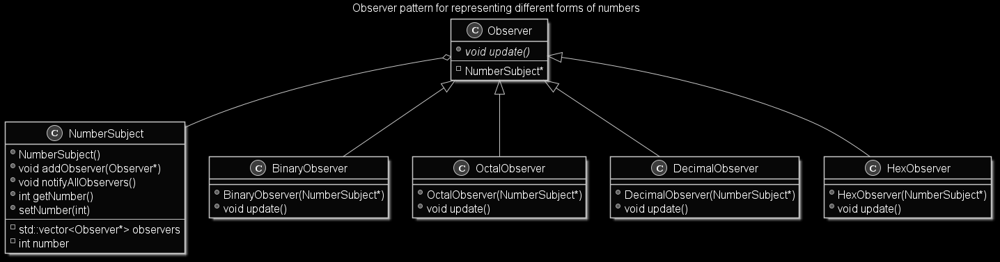

# Observer Pattern
This project showcases the C++ implementation of the Observer pattern, which falls under the Behavorial category of design patterns from the Gang of Four.

Each Observer updates the Subject.

## Tools
* C++14
* g++9.3.0

## References
* https://www.tutorialspoint.com/design_pattern/observer_pattern.htm
