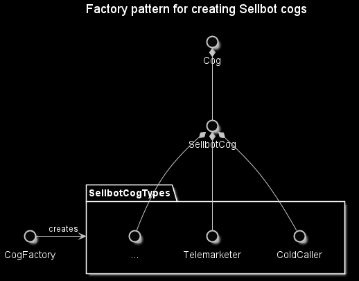

# Factory Pattern
This project is a showcase of the Factory pattern, which is a Creational pattern that is used to create similar objects like a real factory would.

## Synopsis
The example leverages the Factory pattern to generate sellbot cogs from a game called Toontown.

## Navigating the repository
The actual pattern is contained with `CogFactory.py`, and the _"main"_ is found within the scenario tests folder.

## Tools
* Python 3.9.0b3
  * Path to `Factory` folder is added to PYTHONPATH environment variable

## Resources
* https://www.wikiwand.com/en/Factory_method_pattern
* https://www.tutorialspoint.com/design_pattern/factory_pattern.htm

