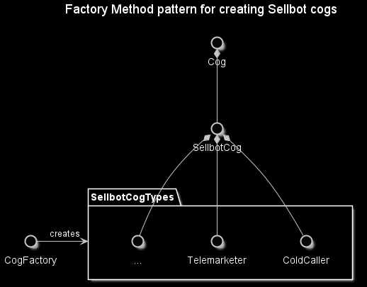

# Factory Method Pattern
This project is a showcase of the Factory Method pattern, which is a Creational pattern that is used to create similar objects like a real factory would. [The key difference between a Factory Method pattern and an Abstract Factory pattern is noted in this brilliant answer from Stack Overflow.](https://stackoverflow.com/a/13030163/5849965) In this example, I only have one Factory that is used to create all of the objects, hence this design is considered to follow the Factory Method pattern.

## Synopsis
The example leverages the Factory Method pattern to generate sellbot cogs from a game called Toontown.

## Navigating the repository
The actual pattern is contained with `CogFactory.py`, and the _"main"_ is found within the scenario tests folder.

## Tools
* Python 3.9.0b3
  * Path to this `FactoryMethod` folder is added to PYTHONPATH environment variable

## Resources
* https://www.wikiwand.com/en/Factory_method_pattern
* https://www.tutorialspoint.com/design_pattern/factory_pattern.htm
* https://stackoverflow.com/questions/5739611/what-are-the-differences-between-abstract-factory-and-factory-design-patterns
* https://stackoverflow.com/questions/1001767/what-is-the-basic-difference-between-the-factory-and-abstract-factory-design-pat
* https://stackoverflow.com/questions/13029261/design-patterns-factory-vs-factory-method-vs-abstract-factory

